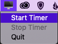

# 20-20-20

Quick and dirty OSX app to let you know when to take a quick break from your screen.

The 20-20-20 rule states that every 20 minutes you should look at something 20 feet away for 20 seconds. This helps your eyes relax and reduces strain. The American Academy of Ophthalmolgy recommends this practice to help with strain ([article](https://www.aao.org/eye-health/tips-prevention/computer-usage)).

Requires Python3!

## Running 


### Standalone

The latest standalone is available from the Releases tab

### Python
```bash
pip install -r requirements.txt
python3 202020.py
```

### Build from source

```
pip install -r requirements.txt
pip install py2app
python setup.py py2app
```
# Usage

Once started, a screen icon will appear in your menu bar. Click on the icon and select start timer, this will automatically notify you in 20 minutes. Once the 20 minutes are up, look away from your screen at a point 20ft away for 20 seconds. Afterwards, the timer will start again automatically.

To stop the timer, click the app's icon and select stop timer. Upon restarting the timer will begin from 20 minutes again.



